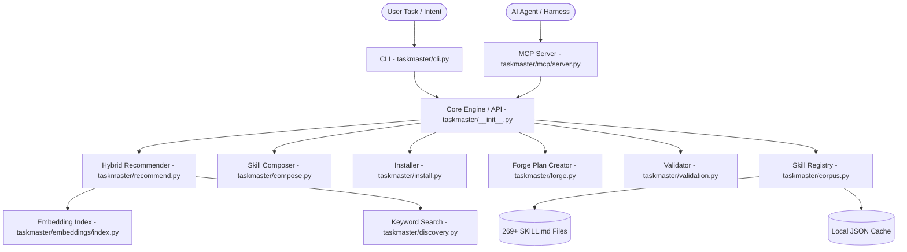

# Architecture

> Auto-generated by /map on 2026-06-09

## Overview

TaskMaster is an agent-native skill routing platform that helps AI coding agents discover, load, compose, validate, and install operational skills. It converts task intent (in natural language) into ranked, dependency-ordered skill recommendations, exposing this corpus of 269+ structured skills (in `SKILL.md` markdown format) via a CLI and an MCP (Model Context Protocol) server.

## System Diagram

## Components

### CLI Dispatcher
- **Purpose:** Handles command-line arguments, options rendering, stdout formatting, and delegates requests to the core engine.
- **Location:** [cli.py](file:///Users/ohmskiii/Documents/Builds/TaskMaster/taskmaster/cli.py)
- **Dependencies:** `taskmaster`, `argparse`, `json`

### Skill Registry / Corpus
- **Purpose:** Scans the `skills/` directory, parses YAML frontmatter and markdown body from each `SKILL.md` file into `SkillRecord` dataclasses, and manages a local JSON file cache (`.taskmaster_cache/skills_cache.json`) with a 300-second TTL.
- **Location:** [corpus.py](file:///Users/ohmskiii/Documents/Builds/TaskMaster/taskmaster/corpus.py)
- **Dependencies:** `yaml`, `json`

### Discoverer & Suggester
- **Purpose:** Implements fuzzy keyword matching, text search, and related-skill lookups using keyword overlap on parsed text fields.
- **Location:** [discovery.py](file:///Users/ohmskiii/Documents/Builds/TaskMaster/taskmaster/discovery.py)
- **Dependencies:** `taskmaster.corpus`

### Hybrid Recommender
- **Purpose:** Computes ranked recommendations using a weighted formula: `0.55 * semantic_similarity + 0.30 * keyword_overlap + 0.15 * tag_overlap`. Falls back to keyword and tag mode (`degraded: true`) if semantic embeddings are unavailable.
- **Location:** [recommend.py](file:///Users/ohmskiii/Documents/Builds/TaskMaster/taskmaster/recommend.py)
- **Dependencies:** `taskmaster.corpus`, `taskmaster.embeddings`

### Skill Composer
- **Purpose:** Composes a dependency-ordered list of skills by reading their `depends_on` metadata, executing a topological sort, detecting cycles, and proposing close-match warnings for missing dependencies.
- **Location:** [compose.py](file:///Users/ohmskiii/Documents/Builds/TaskMaster/taskmaster/compose.py)
- **Dependencies:** `taskmaster.errors`

### Installer
- **Purpose:** Deploys selected skills by symlinking or copying them into supported agent runtimes (Claude, Cursor, Qwen) under user or project scope, keeping track of changes via `.taskmaster-manifest.json`.
- **Location:** [install.py](file:///Users/ohmskiii/Documents/Builds/TaskMaster/taskmaster/install.py)
- **Dependencies:** `pathlib`, `os`

### Forge Engine
- **Purpose:** Turns natural-language tasks into structured agent-ready workspace directories containing execution plans, safety checklists, and prompt packs.
- **Location:** [forge.py](file:///Users/ohmskiii/Documents/Builds/TaskMaster/taskmaster/forge.py)
- **Dependencies:** `taskmaster.recommend`, `taskmaster.compose`

### Validator / Quality Scorer
- **Purpose:** Validates frontmatter structures against constraints (categories, risks, description lengths, size constraints) and assigns quality completeness scores.
- **Location:** [validation.py](file:///Users/ohmskiii/Documents/Builds/TaskMaster/taskmaster/validation.py)
- **Dependencies:** `taskmaster.corpus`

### Embeddings Subsystem
- **Purpose:** Manages text vectorization and storage.
- **Location:** [embeddings/](file:///Users/ohmskiii/Documents/Builds/TaskMaster/taskmaster/embeddings)
- **Subcomponents:**
  - [provider.py](file:///Users/ohmskiii/Documents/Builds/TaskMaster/taskmaster/embeddings/provider.py): Interface for embedding models.
  - [_sentence_transformer_provider.py](file:///Users/ohmskiii/Documents/Builds/TaskMaster/taskmaster/embeddings/_sentence_transformer_provider.py): Local Hugging Face sentence-transformers model mapping (`all-MiniLM-L6-v2`).
  - [_openai_provider.py](file:///Users/ohmskiii/Documents/Builds/TaskMaster/taskmaster/embeddings/_openai_provider.py): Remote OpenAI embeddings client.
  - [index.py](file:///Users/ohmskiii/Documents/Builds/TaskMaster/taskmaster/embeddings/index.py): Persistent FAISS index and incremental update manifest manager.

### MCP Server
- **Purpose:** Exposes FastMCP server tools (recommendation, search, composition, installation) over stdio or SSE transport.
- **Location:** [mcp/server.py](file:///Users/ohmskiii/Documents/Builds/TaskMaster/taskmaster/mcp/server.py)
- **Dependencies:** `mcp.server.fastmcp`

## Data Flow

### 1. Skill Recommendation
1. User requests recommendations for a task query (e.g. `taskmaster recommend "debug Postgres timeout"`).
2. The `recommend` module parses the task into tokens.
3. If an embedding provider is active, it queries the `EmbeddingIndex` (via FAISS) for the top semantic matches.
4. For each skill candidate, it calculates a weighted score combining semantic cosine similarity, keyword overlap, and tag matching.
5. Results are sorted by score and returned to the caller.

### 2. Skill Composition
1. User provides a list of skill names to load or compose (e.g. `taskmaster compose error-detective bug-hunter`).
2. The `compose` module checks if the skills exist in the registry.
3. It builds an adjacency list (dependency graph) by resolving the `depends_on` frontmatter of each skill recursively.
4. Performs a depth-first search topological sort to ensure dependencies come before their dependents.
5. If a cycle is detected, a `CycleError` is raised. If a dependency is missing, a warning and a closest-name suggestion are added to the plan.

## Integration Points

| External Service | Type | Purpose |
|------------------|------|---------|
| **Hugging Face Hub** | Model Download | Automatically downloads `all-MiniLM-L6-v2` for sentence-transformers. |
| **OpenAI API** | REST API | Fetches text embeddings when OpenAI provider is selected. |
| **FastMCP (MCP)** | Library / Protocol | Handles Model Context Protocol JSON-RPC framing for stdio/SSE communication. |

## Conventions

- **Naming:** Files are structured as Python packages with clean boundaries. Command shims mimic console scripts.
- **Structure:** Skill catalog is organized as folders containing `SKILL.md` with YAML frontmatter.
- **Testing:** `pytest` is used for validation and unit/integration testing of CLI, server, recommender, and installer modules.

## Technical Debt

- [ ] **Embedding-sensitive tests failing in base env**: The tests `test_recommend_skills_degraded_in_base_env`, `test_recommend_degraded_banner_in_cli_output`, and `test_recommend_json_includes_degraded_flag_per_result` assert that the results run in degraded mode (degraded: true) when semantic dependencies are absent. However, if `sentence-transformers` is already installed in the environment, the tests fail because the index successfully initializes and returns non-degraded results.
